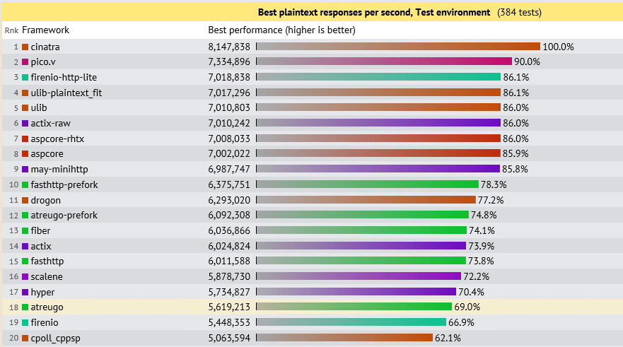
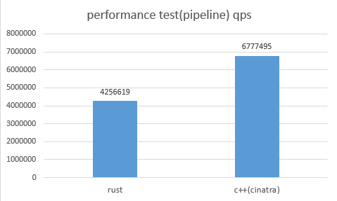

# cinatra--一个高效易用的c++ http框架

<p align="center">
  <a href="https://github.com/qicosmos/cinatra/tree/master/lang/english">English</a> | <span>中文</span>
</p>

# 目录

* [cinatra简介](#cinatra简介)
* [如何使用](#如何使用)
* [快速示例](#快速示例)
* [性能测试](#性能测试)
* [注意事项](#注意事项)
* [roadmap](#roadmap)
* [联系方式](#联系方式)

# cinatra简介
[cinatra](https://github.com/qicosmos/cinatra)是一个高性能易用的http框架，它是用modern c++(c++17)开发的，它的目标是提供一个快速开发的c++ http框架。它的主要特点如下：

1. 统一而简单的接口
2. header-only
3. 跨平台
4. 高效
5. 支持面向切面编程

cinatra目前支持了http1.1/1.0, ssl和websocket, 你可以用它轻易地开发一个http服务器，比如常见的数据库访问服务器、文件上传下载服务器、实时消息推送服务器，你也可以基于cinatra开发一个mqtt服务器。

# 如何使用

## 编译依赖
cinatra是基于boost.asio开发的，所以需要boost库。不过，cinatra同时也支持了ASIO_STANDALONE，你不必一定需要boost库。

cinatra需要的依赖项：

1. C++17 编译器 (gcc 7.2, clang 4.0, Visual Studio 2017 update 15.5,或者更高的版本)
2. Boost.Asio(或者独立的 Asio)
3. Boost.System
4. UUID 库 (Windows: objbase.h , Linux: uuid.h, Mac: CFUUID.h)

## 使用
cinatra是header-only的，直接引用头文件既可。


# 快速示例

## 示例1：一个简单的hello world

	#include "cinatra.hpp"
	using namespace cinatra;
	
	int main() {
		int max_thread_num = std::thread::hardware_concurrency();
		http_server server(max_thread_num);
		server.listen("0.0.0.0", "8080");
		server.set_http_handler<GET, POST>("/", [](request& req, response& res) {
			res.set_status_and_content(status_type::ok, "hello world");
		});

		server.run();
		return 0;
	}

5行代码就可以实现一个简单http服务器了，用户不需要关注多少细节，直接写业务逻辑就行了。

## 示例2：展示如何取header和query以及错误返回

	#include "cinatra.hpp"
	using namespace cinatra;
	
	int main() {
		http_server server(std::thread::hardware_concurrency());
		server.listen("0.0.0.0", "8080");
		server.set_http_handler<GET, POST>("/test", [](request& req, response& res) {
			auto name = req.get_header_value("name");
			if (name.empty()) {
				res.set_status_and_content(status_type::bad_request, "no name");
				return;
			}
	
			auto id = req.get_query_value("id");
			if (id.empty()) {
				res.set_status_and_content(status_type::bad_request);
				return;
			}
	
			res.set_status_and_content(status_type::ok, "hello world");
		});

		server.run();
		return 0;
	}

## 示例3：面向切面的http服务器

	#include "cinatra.hpp"
	using namespace cinatra;

	//日志切面
	struct log_t
	{
		bool before(request& req, response& res) {
			std::cout << "before log" << std::endl;
			return true;
		}
	
		bool after(request& req, response& res) {
			std::cout << "after log" << std::endl;
			return true;
		}
	};
	
	//校验的切面
	struct check {
		bool before(request& req, response& res) {
			std::cout << "before check" << std::endl;
			if (req.get_header_value("name").empty()) {
				res.set_status_and_content(status_type::bad_request);
				return false;
			}
			
			return true;
		}
	
		bool after(request& req, response& res) {
			std::cout << "after check" << std::endl;
			return true;
		}
	};
	
	int main() {
		http_server server(std::thread::hardware_concurrency());
		server.listen("0.0.0.0", "8080");
		server.set_http_handler<GET, POST>("/aspect", [](request& req, response& res) {
			res.set_status_and_content(status_type::ok, "hello world");
		}, check{}, log_t{});

		server.run();
		return 0;
	}
本例中有两个切面，一个校验http请求的切面，一个是日志切面，这个切面用户可以根据需求任意增加。本例会先检查http请求的合法性，如果不合法就会返回bad request，合法就会进入下一个切面，即日志切面，日志切面会打印出一个before表示进入业务逻辑之前的处理，业务逻辑完成之后会打印after表示业务逻辑结束之后的处理。

## 示例4：文件上传
cinatra目前支持了multipart和octet-stream格式的上传。

### multipart文件上传

	#include <atomic>
	#include "cinatra.hpp"
	using namespace cinatra;
	
	int main() {
		http_server server(std::thread::hardware_concurrency());
		server.listen("0.0.0.0", "8080");

		//http upload(multipart)
		server.set_http_handler<GET, POST>("/upload_multipart", [](request& req, response& res) {
			assert(req.get_content_type() == content_type::multipart);
			
			auto& files = req.get_upload_files();
			for (auto& file : files) {
				std::cout << file.get_file_path() << " " << file.get_file_size() << std::endl;
			}
	
			res.set_status_and_content(status_type::ok, "multipart finished");
		});

		server.run();
		return 0;
	}

短短几行代码就可以实现一个http文件上传的服务器了，包含了异常处理和错误处理。

### octet-stream文件上传

	#include <atomic>
	#include "cinatra.hpp"
	using namespace cinatra;
	
	int main() {
		http_server server(std::thread::hardware_concurrency());
		server.listen("0.0.0.0", "8080");

		//http upload(octet-stream)
		server.set_http_handler<GET, POST>("/upload_octet_stream", [](request& req, response& res) {
			assert(req.get_content_type() == content_type::octet_stream);
			auto& files = req.get_upload_files();
			for (auto& file : files) {
				std::cout << file.get_file_path() << " " << file.get_file_size() << std::endl;
			}
	
			res.set_status_and_content(status_type::ok, "octet-stream finished");
		});

		server.run();
		return 0;
	}

## 示例5：文件下载

	//chunked download
	//http://127.0.0.1:8080/assets/show.jpg
	//cinatra will send you the file, if the file is big file(more than 5M) the file will be downloaded by chunked. support continues download

## 示例6：websocket

	#include "cinatra.hpp"
	using namespace cinatra;
	
	int main() {
		http_server server(std::thread::hardware_concurrency());
		server.listen("0.0.0.0", "8080");

		//web socket
		server.set_http_handler<GET, POST>("/ws", [](request& req, response& res) {
			assert(req.get_content_type() == content_type::websocket);
	
			req.on(ws_open, [](request& req){
				std::cout << "websocket start" << std::endl;
			});
	
			req.on(ws_message, [](request& req) {
				auto part_data = req.get_part_data();
				//echo
				std::string str = std::string(part_data.data(), part_data.length());
				req.get_conn()->send_ws_string(std::move(str));
				std::cout << part_data.data() << std::endl;
			});

			req.on(ws_error, [](request& req) {
				std::cout << "websocket pack error or network error" << std::endl;
			});
		});

		server.run();
		return 0;
	}

## 示例7：io_service_inplace
本代码演示如何使用io_service_inplace，然后自己控制http server的运行线程以及循环。
使用 [http://[::1]:8080/close] （IPv6） 或者 [http://127.0.0.1:8080/close] (IPv4) 来关闭http server。

	#include "cinatra.hpp"
	using namespace cinatra;

	int main() {

		bool is_running = true;
		http_server_<io_service_inplace> server;
		server.listen("8080");
	
		server.set_http_handler<GET, POST>("/", [](request& req, response& res) {
			res.set_status_and_content(status_type::ok, "hello world");
		});

		server.set_http_handler<GET, POST>("/close", [&](request& req, response& res) {
			res.set_status_and_content(status_type::ok, "will close");

			is_running = false;
			server.stop();
		});

		while(is_running)
			server.poll_one();

		return 0;
	}

## cinatra客户端使用

### 发get/post消息
```
auto client = cinatra::client_factory::instance().new_client("127.0.0.1", "8080");
client->send_msg("/string", "hello"); //post json, default timeout is 3000ms
client->send_msg<TEXT>("/string", "hello"); //post string, default timeout is 3000ms

client->send_msg<TEXT, 2000>("/string", "hello"); //post string, timeout is 2000ms

client->send_msg<TEXT, 3000, GET>("/string", "hello"); //get string, timeout is 3000ms
```

### 文件上传

异步文件上传接口，只需要提供文件名即可。目前的接口只支持单个文件的上传，后续会支持多文件的上传。
注意：在client文件上传结束之前不要重新上传文件。

```
auto client = cinatra::client_factory::instance().new_client("127.0.0.1", "8080");
client->on_progress([](std::string progress) {
	std::cout << progress << "\n";
});

client->upload_file("/upload_multipart", filename, [](auto ec) {
	if (ec) {
		std::cout << "upload failed, reason: "<<ec.message();
	}
	else {
		std::cout << "upload successful\n";
	}
});
```

如果要支持多文件上传，可以通过遍历方式上传：
```
	for (auto& filename : v) {

		auto client = cinatra::client_factory::instance().new_client("127.0.0.1", "8080");
		client->on_progress([](std::string progress) {
			std::cout << progress << "\n";
		});

		client->upload_file("/upload_multipart", filename, [](auto ec) {
			if (ec) {
				std::cout << "upload failed, reason: "<<ec.message();
			}
			else {
				std::cout << "upload successful\n";
			}
		});

	}
```

### 文件下载

```
auto client = cinatra::client_factory::instance().new_client("127.0.0.1", "8080");
auto s = "/public/static/test1.png";
auto filename = std::filesystem::path(s).filename().string();
client->download_file("temp", filename, s, [](auto ec) {
	if (ec) {
		std::cout << ec.message() << "\n";
	}
	else {
		std::cout << "ok\n";
	}
});
```
先建立连接，输入ip("127.0.0.1", "8080")或域名("purecpp.org", "http")；
downlad_file接口第一个参数是下载目录，这个参数可以不填，如果不填则下载到当前目录；
第二个参数是需要保存的文件名；
第三个参数是静态资源的路径，注意要带上斜杠；
第四个参数是下载的回调，如果没有错误就表示下载完成，否则为下载出错；

#### 设置下载的用户回调
```
client->on_length([](size_t length){
	std::cout<<"recieved data length: "<<length<<"\n";
});

client->on_data([](std::string_view data){
	std::cout<<"recieved data: "<<data<<"\n";
});
```
on_length回调下载的数据的长度；
on_data回调下下载的数据，注意，如果设置了on_data，cinatra将不会去将下载的数据存到文件中，而是完全交给用户去处理；如果没有设置该回调则会默认存文件。

```
	boost::asio::ssl::context ctx(boost::asio::ssl::context::sslv23);
	ctx.set_default_verify_paths();

	auto client = cinatra::client_factory::instance().new_client("127.0.0.1", "https", ctx);
	client->on_length([](size_t _length) {
		std::cout << "download file: on_length: " << _length << std::endl;
	});
	client->download_file("test.jpg", "/public/static/test.jpg", [](boost::system::error_code ec) {
		std::cout << "download file: on_complete: " << (!ec ? "true - " : "false - ") << (ec ? ec.message() : "") << std::endl;
	});

	std::string ss;
	std::cin >> ss;
```

# 性能测试
## 测试用例：





# 注意事项

websocket的业务函数是会多次进入的，因此写业务逻辑的时候需要注意，推荐按照示例中的方式去做。

cinatra目前刚开始在生产环境中使用, 还处于开发完善阶段，可能还有一些bug，因此不建议现阶段直接用于生产环境，建议先在测试环境下试用。

试用没问题了再在生产环境中使用，试用过程中发现了问题请及时提issue反馈或者邮件联系我。

测试和使用稳定之后cinatra会发布正式版。

# roadmap

1. 增加一个基本的client用于server之间的通信

我希望有越来越多的人使用cinatra并喜欢它，也希望cinatra在使用过程中越来越完善，变成一个强大易用、快速开发的http框架，欢迎大家积极参与cinatra项目，可以提issue也可以发邮件提建议，也可以提pr，形式不限。

这次重构的cinatra几乎是重写了一遍，代码比之前的少了30%以上，接口统一了，http和业务分离，具备更好的扩展性和可维护性。

# 联系方式

purecpp@163.com

qq群：340713904

[http://purecpp.org/](http://purecpp.org/ "purecpp")

[https://github.com/qicosmos/cinatra](https://github.com/qicosmos/cinatra "cinatra")


